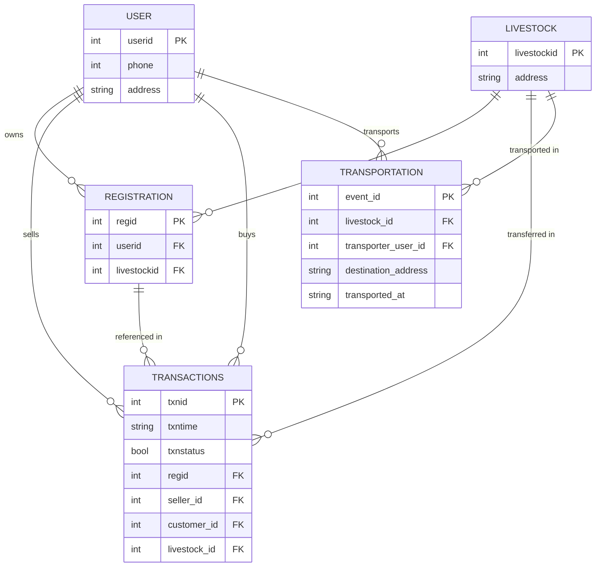

# Cattle-cloud


> [!NOTE]
> This is the helper repo for the [Indian Bovine Breeds Kaggle dataset](https://www.kaggle.com/datasets/lukex9442/indian-bovine-breeds).

Minimal Quick Start: Clone, Install, and Run the Keras-Based Identification Script.
<br/>

### 1. Clone the repository


```bash
git clone https://github.com/pronoym99/Cattle-cloud.git
cd Cattle-cloud
```

### 2. (Optional) Create and activate a virtual environment


#### Windows (PowerShell):
```powershell
python -m venv .venv
.\.venv\Scripts\Activate.ps1
```

#### macOS/Linux:
```bash
python3 -m venv .venv
source .venv/bin/activate
```

### 3. Install required packages

```bash
pip install --upgrade pip
pip install tensorflow pillow numpy sqlalchemy
```

### 4. Run the identification script

```bash

# Run from the repository root:
python identification.py
```

This will:
- Load the Keras model from [models/cattle_identification_keras_model.h5](models/cattle_identification_keras_model.h5)
- Use the sample image at [assets/Indian_bovine_breeds/Hallikar/Hallikar_4.jpg](assets/Indian_bovine_breeds/Hallikar/Hallikar_4.jpg)
- Print the detected class (e.g., `Class detected: <BreedName>`)

### 5. Use your own image

Edit the image path in [identification.py](identification.py):

```python
# In identification.py
from PIL import Image
image = Image.open("path/to/your/image.jpg")
```

Keep the preprocessing (224x224) unchanged.

---

### Database ER Diagram


